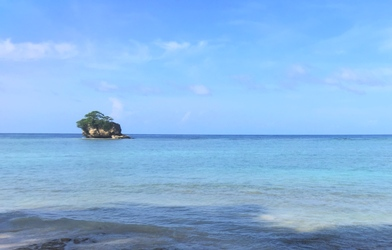

# Multi-CAST Kalamang

[](https://github.com/Multi-CAST/kalamang/actions?query=workflow%3ACLDF-validation)

## How to cite

If you use these data please cite
- the original source
  > Visser, Eline. 2021. Multi-CAST Kalamang. In Haig, Geoffrey & Schnell, Stefan (eds.), Multi-CAST: Multilingual corpus of annotated spoken texts. Version 2108. Bamberg: University of Bamberg. (multicast.aspra.uni-bamberg.de/#kalamang) (date accessed)
- the derived dataset using the DOI of the [particular released version](../../releases/) you were using



## Description


**Kalamang** ([kara1499](https://glottolog.org/resource/languoid/id/kara1499)) is a Papuan language spoken on the Karas Islands in West Papua, Indonesia. It is spoken by some 130 people in two villages on the biggest of the Karas Islands: Maas and Antalisa. Kalamang is under pressure from the local lingua franca, a variant of Papuan Malay, and is not currently spoken by people born after 1990. The texts in this corpus are all traditional narratives and were recorded in 2018 and 2019 as part of Eline Visser's PhD project at Lund University in Sweden, which resulted in a comprehensive grammar of Kalamang ([Visser 2020](Source#cldf:visser2020)). All Kalamang linguistic and cultural data have been deposited on the [Humanities Lab corpus server](http://hdl.handle.net/10050/00-0000-0000-0003-C3E8-1) at Lund University.

This dataset is licensed under a CC-BY-4.0 license

Available online at https://multicast.aspra.uni-bamberg.de/#kalamang


```geojson
{
    "type": "FeatureCollection",
    "features": [
        {
            "type": "Feature",
            "geometry": {
                "type": "Point",
                "coordinates": [
                    132.678,
                    -3.47037
                ]
            }
        },
        {
            "type": "Feature",
            "geometry": {
                "type": "Polygon",
                "coordinates": [
                    [
                        [
                            127.678,
                            1.52963
                        ],
                        [
                            137.678,
                            1.52963
                        ],
                        [
                            137.678,
                            -8.470369999999999
                        ],
                        [
                            127.678,
                            -8.470369999999999
                        ],
                        [
                            127.678,
                            1.52963
                        ]
                    ]
                ]
            }
        }
    ]
}
```

## CLDF Datasets

The following CLDF datasets are available in [cldf](cldf):

- CLDF [TextCorpus](https://github.com/cldf/cldf/tree/master/modules/TextCorpus) at [cldf/TextCorpus-metadata.json](cldf/TextCorpus-metadata.json)