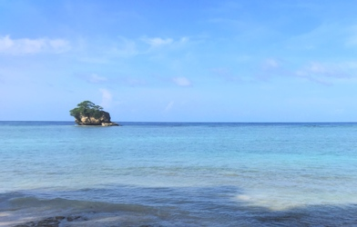

# Multi-CAST Kalamang

## How to cite

If you use these data please cite
- the original source
  > Visser, Eline. 2022. Multi-CAST Kalamang. In Haig, Geoffrey & Schnell, Stefan (eds.), Multi-CAST: Multilingual corpus of annotated spoken texts. Version 2211. Bamberg: University of Bamberg. (multicast.aspra.uni-bamberg.de/#kalamang) (date accessed)
- the derived dataset using the DOI of the [particular released version](../../releases/) you were using



## Description


**Kalamang** ([kara1499](https://glottolog.org/resource/languoid/id/kara1499)) is a Papuan language spoken on the Karas Islands in West Papua, Indonesia. It is spoken by some 130 people in two villages on the biggest of the Karas Islands: Maas and Antalisa. Kalamang is under pressure from the local lingua franca, a variant of Papuan Malay, and is not currently spoken by people born after 1990. The texts in this corpus are all traditional narratives and were recorded in 2018 and 2019 as part of Eline Visser's PhD project at Lund University in Sweden, which resulted in a comprehensive grammar of Kalamang ([Visser 2020](Source#cldf:visser2020)). All Kalamang linguistic and cultural data have been deposited on the [Humanities Lab corpus server](http://hdl.handle.net/10050/00-0000-0000-0003-C3E8-1) at Lund University.

This dataset is licensed under a CC-BY-4.0 license

Available online at https://multicast.aspra.uni-bamberg.de/#kalamang


```geojson
{
    "type": "FeatureCollection",
    "features": [
        {
            "type": "Feature",
            "geometry": {
                "type": "Point",
                "coordinates": [
                    132.678,
                    -3.47037
                ]
            }
        },
        {
            "type": "Feature",
            "geometry": {
                "type": "Polygon",
                "coordinates": [
                    [
                        [
                            127.678,
                            1.52963
                        ],
                        [
                            137.678,
                            1.52963
                        ],
                        [
                            137.678,
                            -8.470369999999999
                        ],
                        [
                            127.678,
                            -8.470369999999999
                        ],
                        [
                            127.678,
                            1.52963
                        ]
                    ]
                ]
            }
        }
    ]
}
```


## Corpus counts

Only a small number of basic GRAID symbols are counted:

*Function symbols*
- ⟨0⟩ zero
- ⟨pro⟩ definite pronoun
- ⟨np⟩ full noun phrase
- ⟨other⟩ form not further specified

*Person/Animacy symbols*
- ⟨.1⟩ first person
- ⟨.2⟩ second person
- ⟨.h⟩ third person, human
- ⟨.d⟩ third person, anthropomorphic
- ø third person, non-human

*Function symbols*
- ⟨:s⟩ subject of an intransitive clause
- ⟨:a⟩ subject of a transitive clause
- ⟨:ncs⟩ non-canonical subject
- ⟨:p⟩ direct object
- ⟨:obl⟩ oblique argument
- ⟨:g⟩ goal argument
- ⟨:l⟩ locational argument
- ⟨:pred⟩ predicate
- ⟨:poss⟩ possessive
- ⟨:other⟩ function not further specified

Only basic categories are listed; categories represented by complex symbols with additional
specifiers (e.g. ⟨dem_pro⟩ ‘demonstrative pronoun’) have been subsumed under the more basic
category (e.g. ⟨pro⟩ ‘definite pronoun’). Please refer to the annotation notes for this corpus for
information on all annotated categories, including those not listed here.

| GRAID | ⟨:s⟩ | ⟨:a⟩ | ⟨:ncs⟩ | ⟨:p⟩ | ⟨:obl⟩ | ⟨:g⟩ | ⟨:l⟩ | ⟨:pred⟩ | ⟨:poss⟩ | ⟨:other⟩ | totals |
|:--------------|-------:|-------:|---------:|-------:|---------:|-------:|-------:|----------:|----------:|-----------:|---------:|
| **⟨0.1⟩** | 3 | 8 | 0 | 1 | 0 | 0 | 0 | 0 | 0 | 0 | 12 |
| **⟨0.2⟩** | 24 | 33 | 0 | 1 | 0 | 0 | 0 | 0 | 0 | 0 | 58 |
| **⟨0.h⟩** | 47 | 45 | 0 | 7 | 0 | 0 | 0 | 0 | 0 | 0 | 99 |
| **⟨0.d⟩** | 29 | 22 | 0 | 8 | 0 | 0 | 0 | 0 | 0 | 0 | 59 |
| **⟨0⟩** | 35 | 11 | 0 | 106 | 0 | 0 | 1 | 17 | 0 | 0 | 170 |
| **⟨pro.1⟩** | 58 | 45 | 0 | 18 | 1 | 1 | 1 | 1 | 21 | 0 | 146 |
| **⟨pro.2⟩** | 31 | 26 | 0 | 9 | 0 | 3 | 2 | 0 | 15 | 0 | 86 |
| **⟨pro.h⟩** | 124 | 67 | 0 | 22 | 3 | 8 | 3 | 0 | 62 | 0 | 289 |
| **⟨pro.d⟩** | 71 | 30 | 0 | 12 | 0 | 5 | 0 | 0 | 18 | 0 | 136 |
| **⟨pro⟩** | 41 | 10 | 0 | 10 | 4 | 10 | 2 | 25 | 31 | 0 | 133 |
| **⟨np.1⟩** | 0 | 0 | 0 | 0 | 0 | 0 | 0 | 0 | 0 | 0 | 0 |
| **⟨np.2⟩** | 0 | 0 | 0 | 0 | 0 | 0 | 0 | 0 | 0 | 0 | 0 |
| **⟨np.h⟩** | 38 | 25 | 0 | 14 | 9 | 3 | 3 | 4 | 0 | 0 | 96 |
| **⟨np.d⟩** | 57 | 9 | 0 | 11 | 0 | 0 | 0 | 0 | 0 | 0 | 77 |
| **⟨np⟩** | 124 | 16 | 0 | 130 | 6 | 44 | 43 | 81 | 0 | 5 | 449 |
| **⟨other.1⟩** | 0 | 0 | 0 | 0 | 0 | 0 | 0 | 0 | 0 | 0 | 0 |
| **⟨other.2⟩** | 0 | 0 | 0 | 0 | 0 | 0 | 0 | 0 | 0 | 0 | 0 |
| **⟨other.h⟩** | 6 | 2 | 0 | 0 | 0 | 0 | 1 | 0 | 0 | 0 | 9 |
| **⟨other.d⟩** | 0 | 0 | 0 | 0 | 0 | 0 | 0 | 0 | 0 | 0 | 0 |
| **⟨other⟩** | 1 | 1 | 0 | 1 | 0 | 0 | 0 | 32 | 0 | 0 | 35 |
| | 689 | 350 | 0 | 350 | 23 | 74 | 56 | 160 | 147 | 5 | 1854 |


**Clause boundaries**

| GRAID | count |
|:-----------|--------:|
| **⟨##⟩** | 1019 |
| **⟨#⟩** | 32 |
| **totals** | 1051 |


## Corpus metadata

- [Annotation notes](cldf/media/annotation-notes.pdf)
- [Translated texts](cldf/media/translated-texts.pdf)


## CLDF Datasets

The following CLDF datasets are available in [cldf](cldf):

- CLDF [TextCorpus](https://github.com/cldf/cldf/tree/master/modules/TextCorpus) at [cldf/TextCorpus-metadata.json](cldf/TextCorpus-metadata.json)